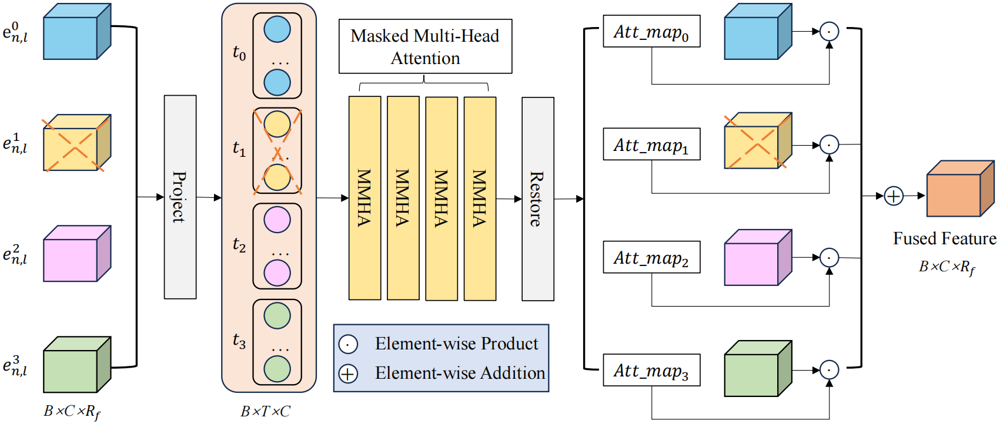
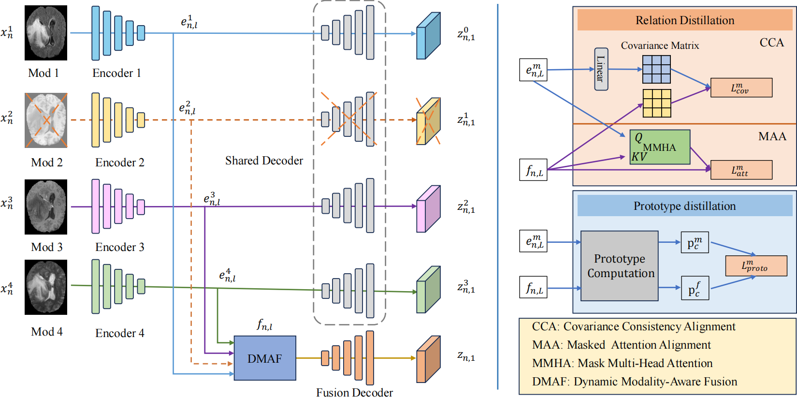

<div align="center">
<h1> DMAF-Net </h1>
<h3>DMAF-Net: An Effective Modality Rebalancing Framework for Incomplete Multi-Modal Medical Image Segmentation</h3>

[Libin Lan]<sup>1</sup> ,[Hongxing Li]<sup>1</sup> ,[Zunhui Xia]<sup>1</sup> ,[Yudong Zhang]<sup>2</sup> :email:</sup>

🏢 <sup>1</sup> College of Computer Science and Engineering, Chongqing University of Technology. <sup>2</sup> School of Computer Science and Engineering, Southeast University.  (<sup>:email:</sup>) corresponding author.
</div>

## 👇Overview
  
### • Abstract
Incomplete multi-modal medical image segmentation faces critical challenges from modality imbalance, including imbalanced modality missing rates and heterogeneous modality contributions. Due to their reliance on idealized assumptions of complete modality availability, existing methods fail to dynamically balance contributions and neglect the structural relationships between modalities, resulting in suboptimal performance in real-world clinical scenarios. To address these limitations, we propose a novel model, named Dynamic Modality-Aware Fusion Network (DMAF-Net). The DMAF-Net adopts three key ideas. First, it introduces a Dynamic Modality-Aware Fusion (DMAF) module to suppress missing-modality interference by combining transformer attention with adaptive masking and weight modality contributions dynamically through attention maps. Second, it designs a synergistic Relation Distillation and Prototype Distillation framework to enforce global-local feature alignment via covariance consistency and masked graph attention, while ensuring semantic consistency through cross-modal class-specific prototype alignment. Third, it presents a Dynamic Training Monitoring (DTM) strategy to stabilize optimization under imbalanced missing rates by tracking distillation gaps in real-time, and to balance convergence speeds across modalities by adaptively reweighting losses and scaling gradients. Extensive experiments on BraTS2020 and MyoPS2020 demonstrate that DMAF-Net outperforms existing methods for incomplete multi-modal medical image segmentation. Extensive experiments on BraTS2020 and MyoPS2020 demonstrate that DMAF-Net outperforms existing methods for incomplete multi-modal medical image segmentation. Our code is available at \url{https://github.com/violet-42/DMAF-Net}.
### • DMAF
<div align="center">

</div>

### • Architecture
<div align="center">

</div>

### When our paper is accepted, we will publish our code.

###  Installation
All our experiments are implemented based on the PyTorch framework with one 24G NVIDIA Geforce RTX 3090 GPU, and we recommend installing the following package versions:
- python=3.9.21
- pytorch=1.13.1
- torchvision=0.14.1

To install Python dependencies:
```
pip install -r requirements.txt
```
### Dataset downloading
Datasets we used are as follows:

- **BraTS2020**: [Kaggle](https://www.kaggle.com/datasets/awsaf49/brats20-dataset-training-validation).

- **MyoPS2020**: [Zmiclab](https://zmiclab.github.io/zxh/0/myops20/). 


After downloading datasets, please check if the path in `codes/options.py` is correct.

### Data Preprocessing
you can simply conduct the preprocessing as following:
``` python
python code/preprocessing/preprocess_brats.py
python code/preprocessing/data_split.py
python code/preprocessing/generate_imb_mr.py
```
After preprocessing, your folder structure is assumed to be:
```
DMAF-Net/
├── datasets
│   ├── BraTS
│   │   ├── BRATS2020_Training_Data
│   │   │   ├── ...
│   │   ├── BRATS2020_Training_none_npy
│   │   │   ├── seg
│   │   │   ├── vol
│   │   │   ├── test.txt
│   │   │   ├── train.txt
│   │   │   ├── val.txt
│   │   ├── brats_split
│   │   │   ├── Brats2020_imb_split_mr2468.csv
├── code
│   ├── ...
└── ...
```
### Experiment
You can conduct the experiment as following if everything is ready.
```
cd ./code
python train.py
python test.py
```
### 📑Acknowledgement
The implementation is based on the repos: [RFNet](https://github.com/dyh127/RFNet), [mmFormer](https://github.com/YaoZhang93/mmFormer), [PASSION](https://github.com/Jun-Jie-Shi/PASSION), we'd like to express our gratitude to these open-source works.
