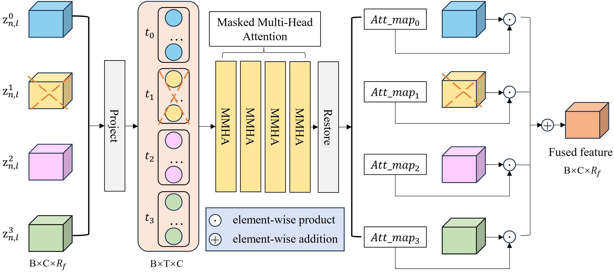

<div align="center">
<h1> 🔥DMAF-Net🎉 </h1>
<h3>Cross-Modal Clustering-Guided Negative Sampling for Self-Supervised Joint Learning from Medical Images and Reports</h3>

[Hongxing Li](https://orcid.org/0009-0002-7958-3976)<sup>1</sup> ,[Zunhui Xia](https://orcid.org/0009-0008-6706-5817)<sup>1</sup> ,[Libin Lan](https://orcid.org/0000-0003-4754-813X)<sup>1</sup> :email:</sup>

🏢 <sup>1</sup> College of Computer Science and Engineering, Chongqing University of Technology.  (<sup>:email:</sup>) corresponding author.
</div>

## 👇Overview
  
### • Abstract
Incomplete multi-modal medical image segmentation faces critical challenges from modality imbalance, including imbalanced modality missing rates and heterogeneous modality contributions. Existing methods are constrained by idealized complete-modality assumptions and fail to dynamically balance contributions while ignoring structural relationships between modalities, resulting in suboptimal performance in real-world clinical scenarios. To address these limitations, we propose the Dynamic Modality-Aware Fusion Network (DMAF-Net), which integrates three key innovations: 1) A Dynamic Modality-Aware Fusion (DMAF) module that combines transformer attention with adaptive masking to suppress missing-modality interference while dynamically weighting modality contributions through attention maps; 2) A synergistic relation distillation and prototype distillation framework that enforces global-local feature alignment via covariance consistency and masked graph attention, while ensuring semantic consistency through cross-modal class-specific prototype alignment; 3) A Dynamic Training Monitoring Strategy (DTMS) that stabilizes optimization under imbalanced missing rates by tracking distillation gaps in real-time, and adaptively reweighting losses and scaling gradients to balance convergence speeds across modalities. Extensive experiments on BraTS2020 and MyoPS2020 demonstrate that DMAF-Net outperforms existing methods for incomplete multi-modal medical image segmentation. This work not only advances the field of incomplete multi-modal medical image segmentation but also provides more reliable technical support for real-world clinical diagnosis.
### • DMAF
<div align="center">

</div>

### • Architecture
<div align="center">

</div>

###  Installation
All our experiments are implemented based on the PyTorch framework with one 24G NVIDIA Geforce RTX 3090 GPU, and we recommend installing the following package versions:
- python=3.9.21
- pytorch=1.13.1
- torchvision=0.14.1

To install Python dependencies:
```
pip install -r requirements.txt
```
### Dataset downloading
Datasets we used are as follows:

- **BraTS2020**: [Kaggle](https://www.kaggle.com/datasets/awsaf49/brats20-dataset-training-validation).

- **MyoPS2020**: [Zmiclab](https://zmiclab.github.io/zxh/0/myops20/). 


After downloading datasets, please check if the path in `codes/options.py` is correct.

### Data Preprocessing
you can simply conduct the preprocessing as following:
``` python
python code/preprocessing/preprocess_brats.py
python code/preprocessing/data_split.py
python code/preprocessing/generate_imb_mr.py
```
After preprocessing, your folder structure is assumed to be:
```
DMAF-Net/
├── datasets
│   ├── BraTS
│   │   ├── BRATS2020_Training_Data
│   │   │   ├── ...
│   │   ├── BRATS2020_Training_none_npy
│   │   │   ├── seg
│   │   │   ├── vol
│   │   │   ├── test.txt
│   │   │   ├── train.txt
│   │   │   ├── val.txt
│   │   ├── brats_split
│   │   │   ├── Brats2020_imb_split_mr2468.csv
├── code
│   ├── ...
└── ...
```
### Experiment
You can conduct the experiment as following if everything is ready.
```
cd ./code
python train.py
python test.py
```
